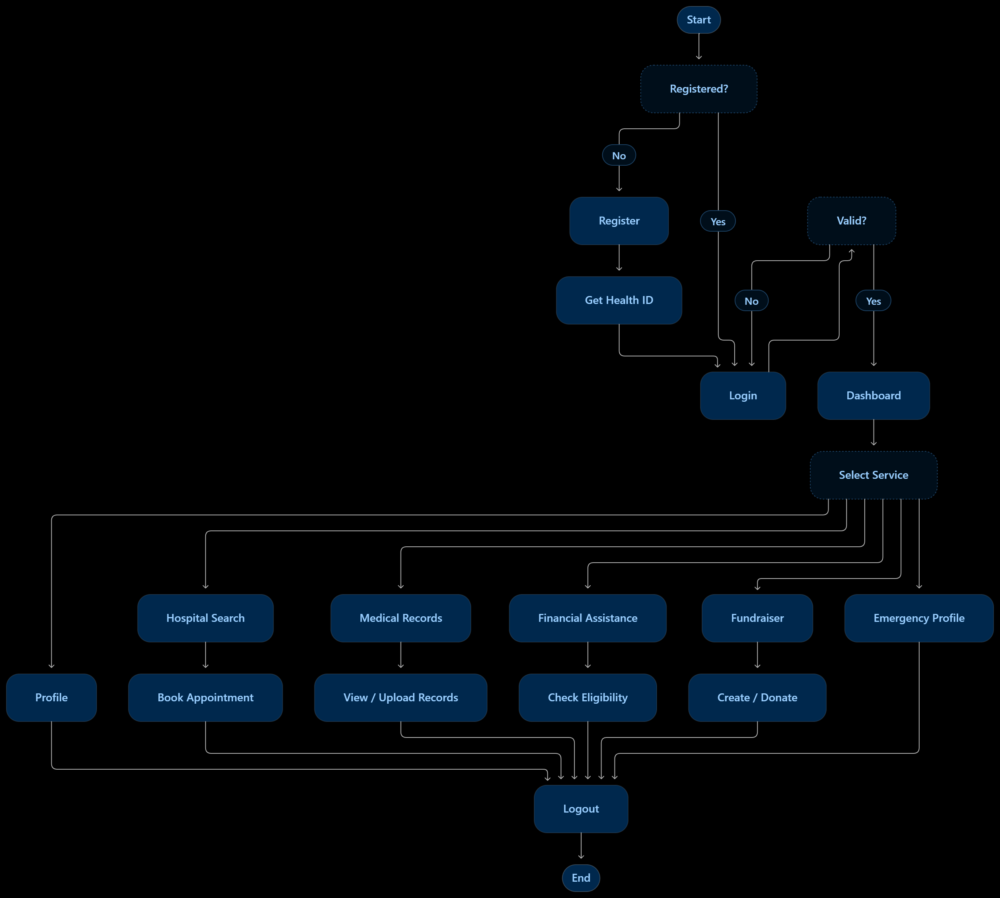
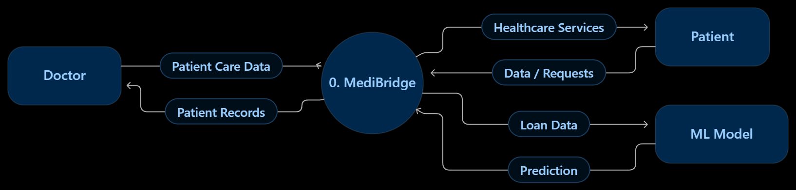
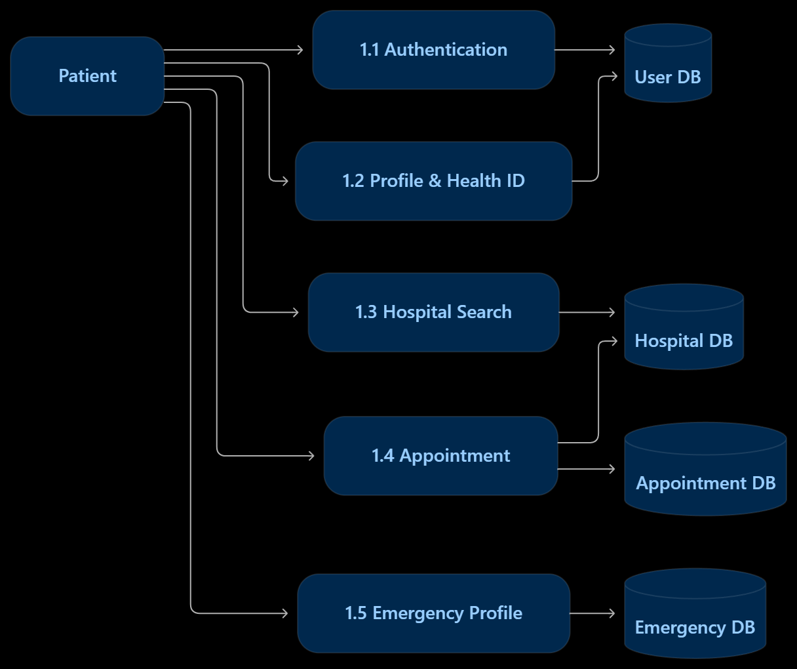
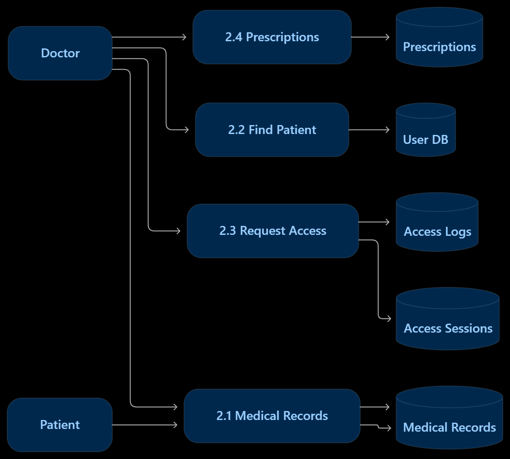
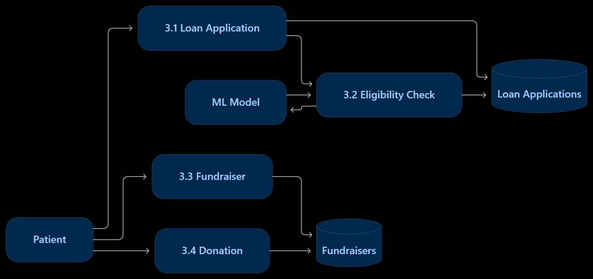
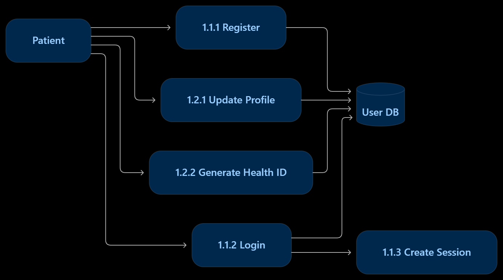
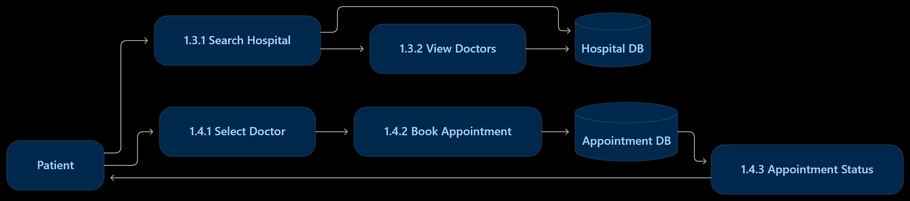
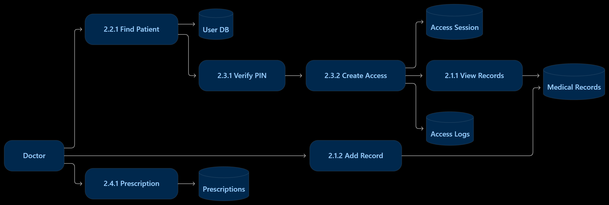
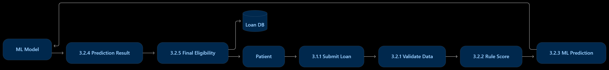
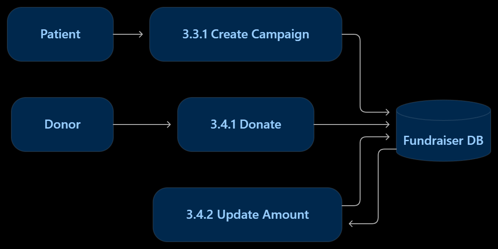

# MediBridge

## Healthcare Access and Financial Assistance Platform

> A patient-focused healthcare platform that brings healthcare discovery, medical information management, emergency information, and financial assistance into one system.

---

| Name | Roll Number |
|---|---:|
| **Suryansh Pahuja** | 1024160058 |
| **Kunal Motwani** | 1024160137 |

---

## Project Goal

Healthcare information is often fragmented across different platforms, while treatment costs and financial assistance can be difficult to arrange.

**MediBridge** aims to provide a unified platform where patients can:

- Create a secure healthcare profile

- Obtain and use a Health ID

- Search hospitals and doctors

- Book appointments

- Store and manage medical records

- Control doctor access to their records

- Manage prescriptions

- Maintain emergency health information

- Apply for financial assistance

- Use ML-assisted loan eligibility prediction

- Create and support healthcare fundraisers

The project follows an **MVP-first development approach**, with healthcare discovery and patient profiles forming the initial foundation and medical-record and financial-assistance workflows being added subsequently.

---

# System Architecture

MediBridge follows a three-layer application architecture.

```text

┌─────────────────────────────────────────────┐

│                 FRONTEND                    │

│          React + Vite + Tailwind            │

│                                             │

│ Patient Dashboard • Doctor Dashboard        │

│ Profiles • Hospitals • Records • Finance     │

└──────────────────────┬──────────────────────┘

                       │ REST API

                       ▼

┌─────────────────────────────────────────────┐

│                  BACKEND                    │

│              Node.js + Express              │

│                                             │

│ Authentication • Records • Appointments     │

│ Doctor Access • Prescriptions • Finance      │

│ Fundraising • Emergency Profiles             │

└───────────────┬─────────────────┬───────────┘

                │                 │

                ▼                 ▼

       ┌────────────────┐   ┌─────────────────┐

       │    MongoDB     │   │  Python/Flask   │

       │                │   │   Model API     │

       │ Users          │   │                 │

       │ Records        │   │ Loan Prediction │

       │ Appointments   │   │                 │

       │ Finance        │   └─────────────────┘

       └────────────────┘

```

### Main Technologies

| Layer | Technology |
|---|---|
| Frontend | React, Vite, React Router, Zustand, Tailwind/CSS |
| Backend | Node.js, Express |
| Database | MongoDB, Mongoose |
| Authentication | JWT, bcryptjs |
| Validation & Security | Joi, Helmet, rate limiting |
| File Storage | Cloudinary |
| ML API | Python, Flask |
| API Communication | REST / Axios |

---

# Core Modules

| Module | Main Functionality |
|---|---|
| Authentication | Patient/doctor registration, login, logout and protected access |
| Health ID | Unique patient identity used for healthcare access |
| Patient Profile | Personal and healthcare profile management |
| Hospital Discovery | Search hospitals, doctors and specialties |
| Appointments | Book and manage hospital appointments |
| Medical Records | Store, upload and manage patient records |
| Doctor Access | Patient-controlled access using Health ID and access PIN |
| Prescriptions | Doctor-created and patient-accessible prescriptions |
| Emergency Profile | Critical health information for emergency situations |
| Financial Assistance | Loan application and eligibility assessment |
| ML Prediction | ML-assisted loan eligibility prediction |
| Fundraising | Healthcare campaigns and donations |

---

### Doctor Record Access Flow

```text

Doctor

   │

   ▼

Search Patient using Health ID

   │

   ▼

Verify Patient Access PIN

   │

   ▼

Create Temporary Access Session

   │

   ├──────► View Medical Records

   │

   ├──────► View Prescriptions

   │

   └──────► Add Authorized Records

             │

             ▼

         Access Log

```

---

# Financial Assistance & ML

The financial-assistance module combines rule-based evaluation with the prediction service.

```text

Patient

   │

   ▼

Loan Application

   │

   ▼

Validate Applicant Data

   │

   ├──────────────► Rule-based Score

   │

   └──────────────► ML Prediction API

                         │

                         ▼

                  Prediction Result

                         │

                         ▼

                  Final Eligibility

                         │

                         ▼

                  Loan Application DB

```

The backend communicates with the separate Python/Flask model API through an HTTP prediction endpoint.

---

# System Diagrams

All project diagrams are maintained under:

`docs/diagrams/`

The repository contains dedicated folders for the major software-engineering diagrams. ******Image references are intentionally included below even when a folder/file has not been populated yet. Add the corresponding image later without changing this README.******

---

## 1. Activity Diagram

Shows the main patient workflow from registration/login through the major MediBridge services.

**Location:** `docs/diagrams/activity_diagram/activity_diagram.png`



> ******Placeholder:****** Add `activity.png` to the folder above if it is not present yet.

---

## 2. Use Case Diagram

Shows the major interactions between the Patient, Doctor and MediBridge system.

**Location:** `docs/diagrams/use_case_diagram/use_case_diagram.png`


> ******Placeholder:****** Add `use_case_diagram.png` to the folder above if it is not present yet.

---

## 3. ER Diagram

Shows the main entities and relationships used by the MediBridge database.

**Location:** `docs/diagrams/er_diagram/er.png`


> ******Placeholder:****** Add `er.png` to the folder above if it is not present yet.

### Main Entities

```text

USER

 ├── Medical Records

 ├── Prescriptions

 ├── Appointments

 ├── Emergency Profile

 ├── Access Sessions / Logs

 ├── Loan Applications

 └── Fundraisers

        └── Donations

HOSPITAL

 └── DOCTOR

```

---

# 4. Data Flow Diagrams

The DFDs are divided into multiple diagrams to keep them readable.

## DFD Level 0 — Context Diagram

**Location:** `docs/diagrams/data_flow_diagram/level0.png`



> ******Placeholder:****** Add `dfd_level_0.png` when the diagram is ready.

---

## DFD Level 1 — Authentication, Profile & Healthcare

**Location:** `docs/diagrams/data_flow_diagram/level1_patient_services.png`



> ******Placeholder:****** Add `dfd_level_1_auth_healthcare.png` when the diagram is ready.

---

## DFD Level 1 — Medical Records & Doctor Access

**Location:** `docs/diagrams/data_flow_diagram/level1_medical_records.png`



> ******Placeholder:****** Add `dfd_level_1_medical_records.png` when the diagram is ready.

---

## DFD Level 1 — Financial Assistance & Fundraising

**Location:** `docs/diagrams/data_flow_diagram/level1_finantial_assistance.png`



> ******Placeholder:****** Add `dfd_level_1_financial.png` when the diagram is ready.

---

## DFD Level 2 — Authentication & Profile

**Location:** `docs/diagrams/data_flow_diagram/level2_authentication.png`



> ******Placeholder:****** Add `dfd_level_2_auth_profile.png` when the diagram is ready.

---

## DFD Level 2 — Hospital & Appointment

**Location:** `docs/diagrams/data_flow_diagram/level2_appointment.png`



> ******Placeholder:****** Add `dfd_level_2_hospital_appointment.png` when the diagram is ready.

---

## DFD Level 2 — Medical Records & Access

**Location:** `docs/diagrams/data_flow_diagram/level2_medical_records.png`



> ******Placeholder:****** Add `dfd_level_2_medical_records.png` when the diagram is ready.

---

## DFD Level 2 — Financial Assistance & ML

**Location:** `docs/diagrams/data_flow_diagram/level2_ml_model.png`



> ******Placeholder:****** Add `dfd_level_2_financial_ml.png` when the diagram is ready.

---

## DFD Level 2 — Fundraising

**Location:** `docs/diagrams/data_flow_diagram/level2_fundraising.png`



> ******Placeholder:****** Add `dfd_level_2_fundraising.png` when the diagram is ready.

---

# 📁 Repository Structure

```text

MediBridge/

│

├── code/

│   ├── client/             # React frontend

│   ├── server/             # Node.js / Express backend

│   ├── model-api/          # Python / Flask ML API

│   └── ARCHITECTURE.md

│

├── docs/

│   └── diagrams/

│       ├── activity_diagram/

│       │   └── activity.png

│       │

│       ├── data_flow_diagram/

│       │   ├── dfd_level_0.png

│       │   ├── dfd_level_1_auth_healthcare.png

│       │   ├── dfd_level_1_medical_records.png

│       │   ├── dfd_level_1_financial.png

│       │   ├── dfd_level_2_auth_profile.png

│       │   ├── dfd_level_2_hospital_appointment.png

│       │   ├── dfd_level_2_medical_records.png

│       │   ├── dfd_level_2_financial_ml.png

│       │   └── dfd_level_2_fundraising.png

│       │

│       ├── er_diagram/

│       │   └── er.png

│       │

│       └── use_case_diagram/

│           └── use_case_diagram.png

│

├── journals/

│   ├── 1024160058-suryansh.md

│   ├── 1024160137-kunal.md

│   └── ...

│

├── project-proposal/

│   └── Project Proposal - MediBridge.pdf

│

└── README.md

```

---

# 🔄 Core Patient Workflow

```text

Register / Login

       │

       ▼

   Health ID

       │

       ▼

    Dashboard

       │

 ┌─────┼─────────┬─────────────┐

 ▼     ▼         ▼             ▼

Hospitals  Records       Financial     Emergency

   │         │              │             │

   ▼         ▼              ▼             ▼

Appointment  Doctor       Loan/ML      Health Info

             Access       Eligibility

                              │

                              ▼

                         Fundraising

```

---

# 👨‍⚕️ Doctor Workflow

```text

Doctor Login

     │

     ▼

Find Patient

using Health ID

     │

     ▼

Verify Access PIN

     │

     ▼

Temporary Access

     │

 ┌───┴──────────────┐

 ▼                  ▼

View Records    Prescriptions

 │                  │

 ▼                  ▼

Add Record       Write Rx

     │

     ▼

Access Log

```

---

# 📌 Project Scope

### Current Core Scope

- Authentication

- Patient profiles

- Health ID

- Hospital and doctor discovery

- Appointment booking

- Medical records

- Doctor-controlled record access

- Prescriptions

- Emergency health information

- Financial assistance

- ML prediction service

- Fundraising

### Future Expansion

The project proposal identifies future expansion through:

- Recommendation capabilities

- Notification systems

- Partner integrations

- Cloud deployment

- API integrations with hospitals and financial organizations

- Modular scaling

---

# 🧪 Evaluation Criteria

The project can be evaluated using:

| Criterion | Purpose |
|---|---|
| Patient workflow completion time | Measures ease and efficiency of common workflows |
| Recommendation usefulness | Evaluates usefulness of system recommendations |
| Document access reliability | Measures reliability of medical-document access |
| User satisfaction | Measures overall user experience |
| System availability | Measures system reliability |

---

# 🔒 Risk Considerations

| Risk | Mitigation |
|---|---|
| Healthcare data privacy | Authentication, authorization and secure storage |
| Large project scope | MVP-first and modular development |
| External healthcare dependencies | API-based modular integration |
| Document security | Controlled access and secure document storage |
| Service dependency | Modular services and fallback handling |

---

# 🚀 Development Approach

MediBridge follows an **incremental MVP-first approach**:

```text

Requirements

     │

     ▼

Architecture

     │

     ▼

Authentication + Profiles

     │

     ▼

Healthcare Discovery

     │

     ▼

Medical Records

     │

     ▼

Financial Assistance + ML

     │

     ▼

Fundraising / Emergency Features

     │

     ▼

Testing + Integration

     │

     ▼

Documentation

```

---

## 📚 Documentation

| Document | Location |
|---|---|
| Project Proposal | `project-proposal/Project Proposal - MediBridge.pdf` |
| Architecture | `code/ARCHITECTURE.md` |
| Activity Diagram | `docs/diagrams/activity_diagram/` |
| Use Case Diagram | `docs/diagrams/use_case_diagram/` |
| ER Diagram | `docs/diagrams/er_diagram/` |
| DFDs | `docs/diagrams/data_flow_diagram/` |
| Team Journals | `journals/` |

---

## 📄 Status

**Project:** MediBridge

**Stage:** MVP / Mid-semester development

**Team Members:** Suryansh Pahuja & Kunal Motwani

> ER and Use Case image placeholders are intentionally kept because those two folders are currently empty except for `.gitkeep`.
